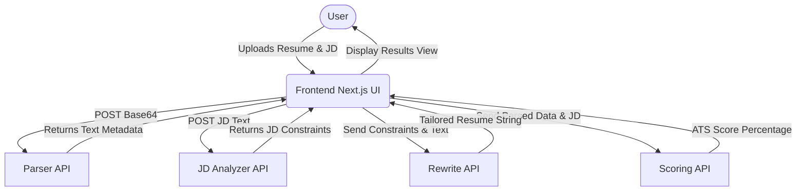

# System Architecture

## Overview
The Advanced AI Resume Tailorer utilizes a React/Next.js frontend to allow users to interact with a suite of Node.js microservices. These services independently handle specific domains of the recruitment optimization pipeline.

## Flow Diagram

## Microservices Breakdown
- **Parser API**: Extracts text from user uploads.
- **JD Analyzer API**: Infers capabilities required from the Job Description text.
- **Rewrite API**: AI augmentation of original experience into tailored bullet points.
- **Scoring API**: ATS scoring simulation based on keyword matching criteria.
